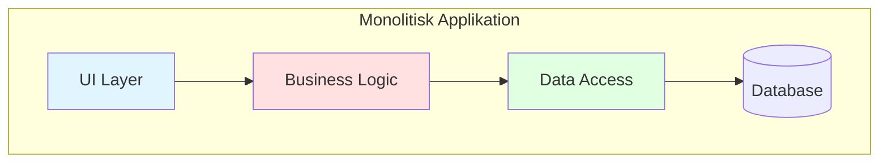
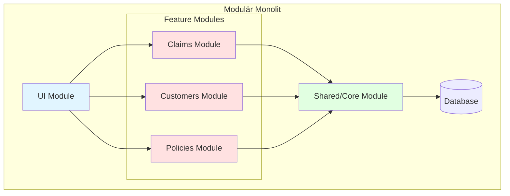
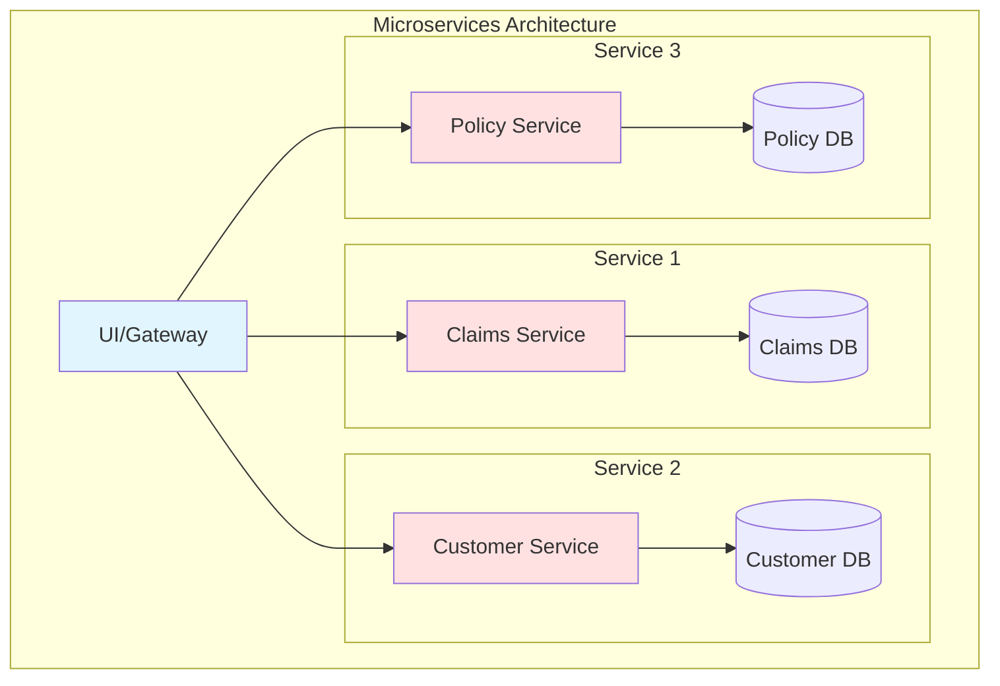
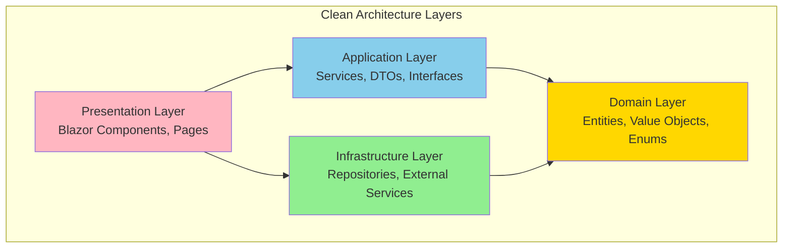

# Del 1: Introduktion till Modulär Applikationsstruktur

---

## Lektionsöversikt

- Vad är modulär arkitektur och varför behöver vi det?
- Monolit vs Modulär Monolit vs Microservices
- Grundläggande principer för separation
- Introduktion till Clean Architecture
- Hur detta appliceras i .NET-projekt

---

## 1. Vad är modulär arkitektur?

### Definition

Modulär arkitektur handlar om att dela upp en applikation i **väldefinierade, löst kopplade delar** där varje del har ett **tydligt ansvar** och kan **utvecklas, testas och underhållas oberoende**.

### Varför modulär struktur?

**Problem med ostrukturerad kod:**

- Svårt att hitta var funktionalitet finns
- Ändringar i en del påverkar oväntat andra delar
- Svårt att testa isolerat
- Svårt att onboarda nya utvecklare
- Tekniska skulder växer snabbt

**Fördelar med modulär struktur:**

- **Förståelse:** Tydlig struktur gör det enkelt att hitta kod
- **Testbarhet:** Varje modul kan testas isolerat
- **Återanvändbarhet:** Moduler kan användas i olika kontexter
- **Skalbarhet:** Enkelt att utöka med ny funktionalitet
- **Team-arbete:** Flera utvecklare kan arbeta parallellt utan konflikter

### Viktiga principer

**1. Separation of Concerns (SoC)**

- Olika delar av systemet hanterar olika ansvarsområden
- UI-logik separeras från affärslogik
- Affärslogik separeras från dataåtkomst

**2. Dependency Inversion**

- Beroenden pekar inåt mot domänen
- Abstraktioner (interfaces) istället för konkreta implementationer
- Infrastructure beror på Domain, inte tvärtom

**3. Single Responsibility**

- Varje klass/modul har ett enda ansvar
- Om en klass gör för mycket, dela upp den

---

## 2. Arkitekturmönster - en jämförelse

### Monolit



**Karakteristik:**

- Allt i en kodbase och deployment-enhet
- Delade dependencies
- Körs som en process

**Fördelar:**

- Enkel att utveckla initialt
- Enkel deployment
- Enkel att debugga

**Nackdelar:**

- Svårt att skala specifika delar
- Lång build-tid när projektet växer
- Risk för tight coupling
- Svårt att byta teknik för en del

---

### Modulär Monolit



**Karakteristik:**

- En kodbase, men tydligt separerade moduler
- Varje modul har sina egna boundaries
- Fortfarande en deployment-enhet
- **Detta är vårt fokus!**

**Fördelar:**

- Bättre struktur än klassisk monolit
- Enklare att navigera och underhålla
- Moduler kan utvecklas parallellt
- Lättare att testa
- Kan utvecklas till microservices vid behov

**Nackdelar:**

- Fortfarande en deployment-enhet
- Kräver disciplin att upprätthålla boundaries

---

### Microservices



**Karakteristik:**

- Separata services med egna databaser
- Oberoende deployment
- Kommunikation via API/messaging

**Fördelar:**

- Maximal flexibilitet
- Kan skala services individuellt
- Olika tekniker för olika services

**Nackdelar:**

- Komplex infrastruktur
- Distributed systems-problem (latency, consistency)
- Kräver DevOps-mognad
- Svårare att debugga

---

## 3. Clean Architecture - översikt

### Grundprinciperna

Clean Architecture (även kallad Hexagonal, Onion, eller Ports & Adapters) bygger på:

1. **Independence of frameworks** - Arkitekturen är inte beroende av specifika ramverk
2. **Testability** - Affärslogik kan testas utan UI, databas eller externa system
3. **Independence of UI** - UI kan bytas ut utan att ändra affärslogik
4. **Independence of Database** - Databas kan bytas ut
5. **Independence of external agencies** - Affärslogik vet inte om externa system

### Lagerbeskrivning



#### Domain Layer (Kärnan)

- **Innehåller:** Entities, Value Objects, Enums, Domain Events
- **Ansvar:** Affärsregler och domänlogik
- **Beroenden:** Inga! Detta är hjärtat
- **Exempel:** `Claim`, `VehicleClaim`, `ClaimType`

#### Application Layer

- **Innehåller:** Services, Use Cases, DTOs, Interfaces
- **Ansvar:** Orkestrering av affärslogik, koordinering
- **Beroenden:** Domain Layer
- **Exempel:** `ClaimService`, `IClaimRepository`

#### Infrastructure Layer

- **Innehåller:** Repository-implementationer, External API clients, Database context
- **Ansvar:** Tekniska detaljer, integration med externa system
- **Beroenden:** Domain Layer (via interfaces från Application)
- **Exempel:** `InMemoryClaimRepository`, `SqlClaimRepository`

#### Presentation Layer (UI)

- **Innehåller:** Blazor Components, Pages, ViewModels
- **Ansvar:** Användarinteraktion, presentation
- **Beroenden:** Application Layer
- **Exempel:** `CreateClaim.razor`, `ClaimList.razor`

---

## 4. Hur detta appliceras i .NET

### Projektstruktur - två alternativ

**Alternativ 1: Mappar i ett projekt** (enklare, bra för mindre appar)

```
ClaimApp/
├── Components/          # Blazor UI
├── Application/
│   └── Services/
├── Domain/
│   └── Models/
└── Infrastructure/
    └── Repositories/
```

**Alternativ 2: Separata projekt** (bättre separation, rekommenderat för större appar)

```
ClaimApp.sln
├── ClaimApp.Web/              # Blazor UI-projekt
├── ClaimApp.Application/      # Services & interfaces
├── ClaimApp.Domain/           # Domain models
└── ClaimApp.Infrastructure/   # Repositories, external services
```

### Beroenden i .NET

```
ClaimApp.Web
  ├── Referens till Application
  └── Referens till Infrastructure (för DI-setup)

ClaimApp.Application
  └── Referens till Domain

ClaimApp.Infrastructure
  └── Referens till Domain (implementerar interfaces från Application)

ClaimApp.Domain
  └── Inga referenser! (ren C#)
```

---

## Diskussionsfrågor

Ta några minuter för att diskutera i gruppen:

1. **Vilken typ av arkitektur använder ni idag i era projekt?**

   - Är det mer monolit eller modulär?
   - Finns det tydliga gränser mellan lager?

2. **Vilka utmaningar ser ni med att införa modulär struktur?**

   - Tid? Komplexitet? Team-buy-in?

3. **När är det "för mycket" arkitektur?**
   - Finns det situationer där en enkel monolit är bättre?

---

## Sammanfattning

**Viktiga takeaways:**

✅ Modulär arkitektur handlar om **separation och tydliga gränser**

✅ Modulär monolit är en **bra balans** mellan enkelhet och struktur

✅ Clean Architecture ger **testbar och underhållbar kod**

✅ Beroenden pekar **inåt mot domänen**

✅ I .NET kan vi implementera detta med **mappar eller separata projekt**
