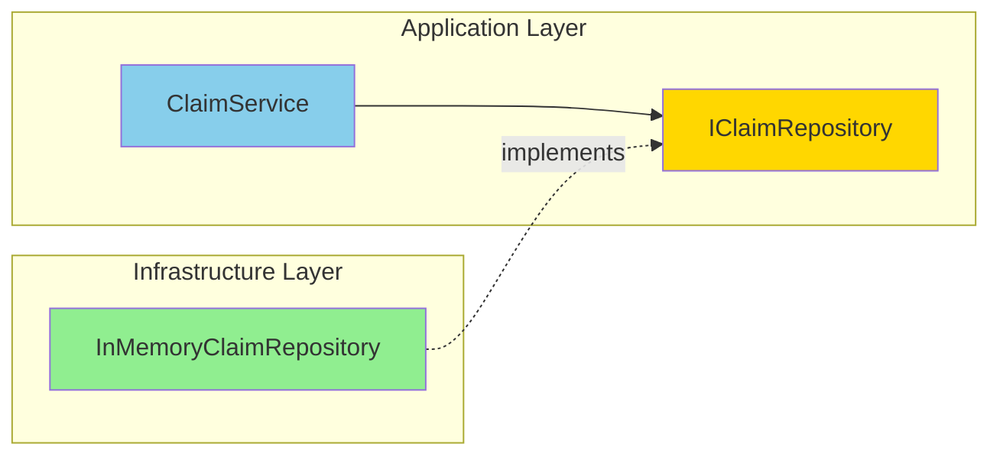
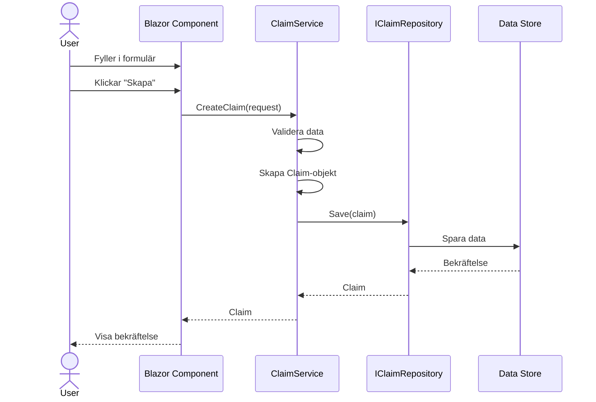
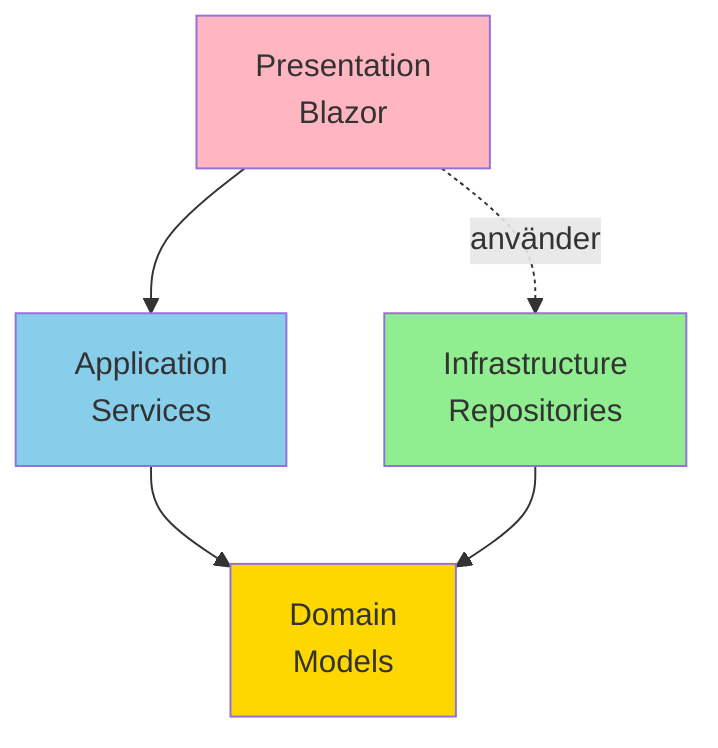

# Del 2: Moduler och Lager i Praktiken

---

## Lektionsöversikt

- Fördjupning i varje lager
- Dependency Injection i .NET
- Interfaces och abstraktioner
- Data flow genom applikationen
- Best practices

---

## 1. Domain Layer - Hjärtat av applikationen

### Vad är Domain Layer?

Domain Layer innehåller **affärslogiken och reglerna** för din applikation. Det är den enda delen som verkligen beskriver vad systemet gör, oberoende av tekniska detaljer.

### Innehåll i Domain Layer

**Entities** - Objekt med identitet

```csharp
public class Claim
{
    public Guid Id { get; set; }
    public ClaimType Type { get; set; }
    public DateTime ReportedDate { get; set; }
    public string Description { get; set; }
    public ClaimStatus Status { get; set; }

    // Domänlogik här
    public bool IsRecentClaim()
    {
        return (DateTime.Now - ReportedDate).TotalDays <= 30;
    }
}
```

**Value Objects** - Objekt definierade av sina värden

```csharp
public class Address
{
    public string Street { get; }
    public string City { get; }
    public string PostalCode { get; }

    public Address(string street, string city, string postalCode)
    {
        Street = street;
        City = city;
        PostalCode = postalCode;
    }

    // Immutable - kan inte ändras efter att ha skapats
}
```

**Enums** - Uppräknade typer

```csharp
public enum ClaimType
{
    Vehicle,
    Property,
    Travel
}

public enum ClaimStatus
{
    Pending,
    UnderReview,
    Approved,
    Rejected
}
```

### Viktiga principer för Domain Layer

✅ **Inga tekniska beroenden** - ingen referens till databas, UI, externa API:er

✅ **Ren C#-kod** - inga ramverks-specifika attribut eller klasser

✅ **Affärsregler här** - om det är en affärsregel, lägg den i domänen

✅ **Testbar** - ska kunna testas utan mock-objekt

❌ **Inte dataåtkomst** - ingen kod för att hämta/spara data

❌ **Inte UI-logik** - ingen kod för presentation

---

## 2. Application Layer - Orkestrering

### Vad är Application Layer?

Application Layer **koordinerar** arbetet mellan olika delar av systemet. Det definierar **use cases** (vad användaren kan göra) och orkestrerar domänlogiken.

### Innehåll i Application Layer

**Services** - Koordinerar use cases

```csharp
public interface IClaimService
{
    Task<Claim> CreateClaim(ClaimRequest request);
    Task<IEnumerable<Claim>> GetAllClaims();
    Task<Claim> GetClaimById(Guid id);
}

public class ClaimService : IClaimService
{
    private readonly IClaimRepository _repository;

    public ClaimService(IClaimRepository repository)
    {
        _repository = repository;
    }

    public async Task<Claim> CreateClaim(ClaimRequest request)
    {
        // Validering
        if (request.ReportedDate > DateTime.Now)
            throw new ArgumentException("Cannot report future claims");

        // Skapa domänobjekt
        var claim = new Claim
        {
            Id = Guid.NewGuid(),
            Type = request.Type,
            ReportedDate = request.ReportedDate,
            Description = request.Description,
            Status = ClaimStatus.Pending
        };

        // Spara via repository
        return await _repository.Save(claim);
    }
}
```

**DTOs (Data Transfer Objects)** - Objekt för att transportera data

```csharp
public class ClaimRequest
{
    public ClaimType Type { get; set; }
    public DateTime ReportedDate { get; set; }
    public string Description { get; set; }

    // Vehicle-specifika fält
    public string? RegistrationNumber { get; set; }

    // Property-specifika fält
    public string? Address { get; set; }
    public PropertyDamageType? PropertyDamageType { get; set; }
}
```

**Interfaces för repositories**

```csharp
public interface IClaimRepository
{
    Task<Claim> Save(Claim claim);
    Task<Claim?> GetById(Guid id);
    Task<IEnumerable<Claim>> GetAll();
}
```

### Varför interfaces?

**Dependency Inversion Principle:**



- Application Layer definierar **vad** den behöver (interface)
- Infrastructure Layer implementerar **hur** det görs
- Service beror på abstraktion, inte konkret implementation
- Lätt att byta implementation (in-memory → SQL → NoSQL)

---

## 3. Infrastructure Layer - Tekniska detaljer

### Vad är Infrastructure Layer?

Infrastructure Layer innehåller **tekniska implementationer** av interfaces definierade i Application Layer. Detta är där vi pratar med databaser, externa API:er, filsystem, etc.

### Innehåll i Infrastructure Layer

**Repository-implementationer**

```csharp
public class InMemoryClaimRepository : IClaimRepository
{
    private readonly List<Claim> _claims = new();

    public Task<Claim> Save(Claim claim)
    {
        _claims.Add(claim);
        return Task.FromResult(claim);
    }

    public Task<Claim?> GetById(Guid id)
    {
        var claim = _claims.FirstOrDefault(c => c.Id == id);
        return Task.FromResult(claim);
    }

    public Task<IEnumerable<Claim>> GetAll()
    {
        return Task.FromResult<IEnumerable<Claim>>(_claims);
    }
}
```

**Varför denna separering?**

✅ **Testbarhet** - Application Layer kan testas med mock-repositories

✅ **Flexibilitet** - Byt databas utan att ändra affärslogik

✅ **Parallellt arbete** - Någon kan jobba med UI medan någon bygger infrastruktur

### Framtida expansion

Samma interface, olika implementationer:

```csharp
// För utveckling
public class InMemoryClaimRepository : IClaimRepository { ... }

// För produktion
public class SqlClaimRepository : IClaimRepository
{
    private readonly ApplicationDbContext _context;
    // ... EF Core implementation
}

// För integration med annat system
public class ApiClaimRepository : IClaimRepository
{
    private readonly HttpClient _httpClient;
    // ... API-anrop
}
```

---

## 4. Presentation Layer - UI

### Vad är Presentation Layer?

Presentation Layer hanterar **användarinteraktion** och visar data. I vårt fall: Blazor-komponenter.

### Ansvarsområden

✅ **Visa data** från Application Layer

✅ **Samla input** från användaren

✅ **Grundläggande validering** (format, required fields)

❌ **Inte affärslogik** - det ligger i Domain/Application

❌ **Inte dataåtkomst** - det ligger i Infrastructure

### Exempel på komponent-struktur

```
Components/
├── Pages/
│   ├── Index.razor
│   └── CreateClaim.razor
├── Shared/
│   ├── MainLayout.razor
│   └── NavMenu.razor
└── ClaimForms/
    ├── VehicleClaimForm.razor
    └── PropertyClaimForm.razor
```

**Separation även här:**

- **Pages** - sidor som användaren navigerar till
- **Shared** - layout och navigation
- **ClaimForms** - återanvändbara formulär-komponenter

---

## 5. Dependency Injection i .NET

### Vad är Dependency Injection?

Istället för att en klass skapar sina egna beroenden, **får den dem utifrån**.

**Utan DI (tight coupling):**

```csharp
public class ClaimService
{
    private readonly IClaimRepository _repository;

    public ClaimService()
    {
        // Hårdkodat beroende - svårt att testa, svårt att ändra
        _repository = new InMemoryClaimRepository();
    }
}
```

**Med DI (loose coupling):**

```csharp
public class ClaimService
{
    private readonly IClaimRepository _repository;

    // Beroendet injiceras via constructor
    public ClaimService(IClaimRepository repository)
    {
        _repository = repository;
    }
}
```

### Setup i Program.cs

```csharp
var builder = WebApplication.CreateBuilder(args);

// Registrera services i DI-containern
builder.Services.AddScoped<IClaimService, ClaimService>();
builder.Services.AddSingleton<IClaimRepository, InMemoryClaimRepository>();

var app = builder.Build();
```

**Livscykler:**

- **Singleton** - en instans för hela applikationens livstid (bra för in-memory data)
- **Scoped** - en instans per request (bra för services)
- **Transient** - ny instans varje gång (bra för lightweight stateless objects)

### Varför DI?

✅ **Testbarhet** - lätt att injicera mock-objekt i tester

✅ **Flexibilitet** - byt implementation på ett ställe

✅ **Separation** - klasser känner bara till interfaces

---

## 6. Data Flow genom applikationen

### Sequence Diagram - skapa en claim



### Beroenden pekar inåt



**Observera:**

- UI beror på Application (använder services)
- Application beror på Domain (använder entities)
- Infrastructure beror på Domain (implementerar interfaces)
- **Ingen beror på Infrastructure-implementationer** (bara interfaces)

---

## 7. Best Practices

### Gör:

✅ **Håll Domain Layer ren** - inga tekniska beroenden

✅ **Använd interfaces** för beroenden mellan lager

✅ **En klass, ett ansvar** - om den gör för mycket, dela upp

✅ **Namnge tydligt** - `ClaimService`, inte `Manager` eller `Helper`

✅ **Validering på rätt nivå:**

- Format/required i UI
- Affärsregler i Domain/Application

### Undvik:

❌ **Cirkulära beroenden** - om A beror på B som beror på A, något är fel

❌ **Direkt databasaccess från UI** - gå alltid via Application Layer

❌ **Affärslogik i Infrastructure** - håll det tekniskt

❌ **Guds-objekt** - en klass som gör allt

---

## Diskussionsfrågor

1. **Var skulle ni lägga validering för att en skadeanmälan inte får vara äldre än 30 dagar?**

   - I UI? Domain? Application?

2. **Om ni ska byta från in-memory till SQL Server, vad behöver ändras?**

   - Vilka lager påverkas?

3. **Hur testar vi ClaimService isolerat?**
   - Vad behöver vi mocka?

---

## Sammanfattning

**Fyra lager med tydliga ansvarsområden:**

| Lager              | Ansvar                  | Beroenden               |
| ------------------ | ----------------------- | ----------------------- |
| **Domain**         | Affärslogik, regler     | Inga                    |
| **Application**    | Use cases, koordinering | Domain                  |
| **Infrastructure** | Teknisk implementation  | Domain (via interfaces) |
| **Presentation**   | Användarinteraktion     | Application             |
